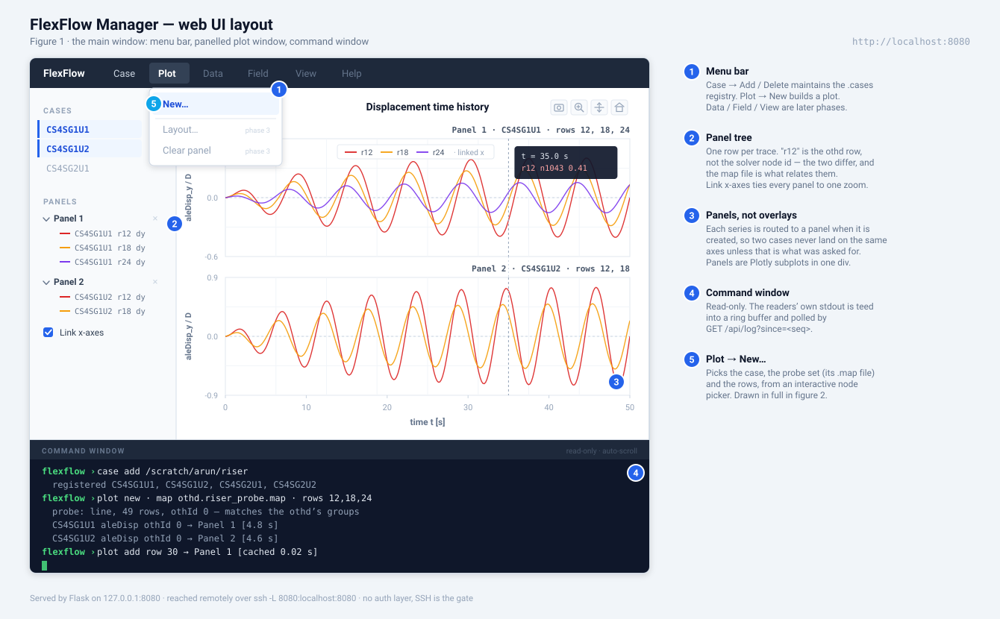
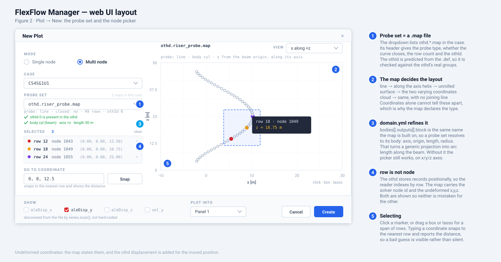

# Web UI — Plan

A browser front end for post-processing FlexFlow simulation results, served by
Flask from the machine that holds the case data and reached from anywhere over
an SSH tunnel.

The first milestone: **a menu bar, a panelled plot window, a command window,
`Case → Add / Delete`, and `Plot → New` — which picks rows off an interactive
node picker built from the case's `.map` files.** Everything else in FlexFlow
stays on the CLI until that skeleton is solid.





---

## 1. Decisions

| Question | Decision | Why |
|---|---|---|
| Framework | **Flask 3.1** (already installed), no build step | Matches the project's plain-Python, no-toolchain style |
| Plot rendering | **JSON API + Plotly.js in the browser** | Zoom, pan, hover, series toggling and PNG export are free and instant |
| Reader | **`src/core/readers/series.py`, not `OTHDReader`** | It is `othId`-aware and discovers variables by reading. `OTHDReader` is neither, and is wrong on multi-group cases (§3) |
| Several nodes or cases | **Panels, routed at creation time** | Each series is assigned a panel when made, so nothing is overlaid by accident (§5) |
| Choosing nodes | **Interactive picker built from `othd.*.map`** | The map already carries row → node → coordinates *and* a declared probe type, which is exactly what a picker needs (§6) |
| Picker layout | **The map's `# probe:` decides it** | Geometry cannot be recovered from coordinates, so the map declares it (§6) |
| Picker frame | **`domain.yml` when present, generic axes otherwise** | Resolves a probe set to its body and gives axis, origin, length, radius. An upgrade, never a requirement (§7) |
| Picker view | **2-D, with a View selector** | Keeps `plotly-basic` (~1 MB) and gives click/box/lasso. 3-D needs a 3.5 MB bundle and is worse for picking |
| Missing `.map` | **Offer "Write map now" in the dialog** | Calls `write_case_maps()`. The one place the web layer writes outside `.cases` (§10) |
| Command window | **Read-only output log** | No input box, so no remote command execution surface |
| Access | **Bind `127.0.0.1`, reach it over `ssh -L`** | SSH is the authentication |
| Front-end deps | **Vendored `plotly-basic.min.js`**, no CDN | Compute nodes are often air-gapped |

---

## 2. Where it sits in the tree

```
src/web/
  __init__.py
  __main__.py            # python -m src.web --root . --port 8080
  server.py              # app factory, route registration, safety checks
  api/
    cases.py             # /api/cases*          registry + metadata
    maps.py              # /api/cases/<n>/maps  probe sets and their rows
    history.py           # /api/cases/<n>/history
    log.py               # /api/log
  services/
    registry.py          # .cases read/write, non-interactive
    mapfile.py           # parse othd.<block>.map: header + rows
    frame.py             # domain.yml -> the body behind a probe set
    project.py           # probe + frame -> the picker's views
    loader.py            # series.scan/load, with the reader cache
    logbuf.py            # ring buffer + stdout capture
  static/
    js/{app,menu,newplot,picker,panels,plot,log}.js
    vendor/plotly-basic.min.js
  templates/index.html
```

The dependency runs one way: **web → core/commands**, never the reverse.

---

## 3. The reader: use `series.py`, and a bug it exposes

There are two readers in the tree. Which one the web app uses is the single most
consequential choice in this plan.

| | `OTHDReader` | `series.py` |
|---|---|---|
| Location | `src/core/readers/othd_reader.py` | `src/core/readers/series.py` |
| Variables | `aleDisp` and pendulum fields, hard-coded | Discovered by reading the file |
| `othId` groups | **Ignored** | `scan()` returns `by_group`; `load(..., group=N)` |
| Used by | `FlexFlowCase`, and so `plot` / `compare` | `data show` / `data table` / `data stats` |
| API | `get_node_displacements(row)` | `scan(paths)` → `SeriesMeta`; `load(paths, names, meta, group)` → `{name: (nsteps, nnodes, ncomp)}` |

`series.py` wins on every axis that matters here, and its docstring already
states the reason: *"two probe sets in one file is a thing the format allows,
and reading only the last of them would be silent and wrong."*

### The bug, since several nodal blocks per case is the normal shape here

A real othd interleaves groups within one timestep — from
`examples/BR0SG0U1P0/othd_files/riser1.othd`:

```
tsId 1
time 5.0000000000000003e-02
othId 0
othFlag 1
vel 3 49
  ... 49 lines ...
```

`OTHDReader` (`othd_reader.py:58-128`) knows only `tsId`, `time`, `aleDisp` and
the pendulum fields. **`othId` is not one of its branches**, so it is skipped as
an unrecognised line. Its `aleDisp` branch then does this: if `current_time` is
already in `time_to_index` it *reuses that timestep index* and writes rows
`0 .. nnodes-1` again.

So for a timestep carrying group 0 with 49 rows and group 1 with 12 rows, the
result is not "the last group wins" — it is a splice:

- rows 0–11 hold **group 1**
- rows 12–48 hold **group 0**
- `num_nodes` stays 49

with no warning. Since you have several nodal blocks per case as a matter of
course, **`plot` and `compare` are currently returning spliced data for those
cases** — they go through `FlexFlowCase.load_othd_data()`, which builds an
`OTHDReader`. `data table` / `data stats` are unaffected; they already use
`series.py`.

This is a live CLI correctness bug, not a web-UI blocker. The web app avoids it
by using `series.py` from the start and needs no reader change at all. Fixing
the CLI path is a separate piece of work on its own branch — worth doing, and
worth doing before trusting any existing `plot` output from a multi-group case.

### What this buys the web app

`SeriesMeta` answers everything the UI needs without a second pass:
`groups` (the `othId`s present), `variables_of(group)` (`VarInfo` with `ncomp`,
`nnodes`, and `columns` giving `aleDisp_x/_y/_z`), `nodes_of(group)`, `times`.
The component checkboxes in the New Plot dialog are therefore *discovered*, not
hard-coded — a case that writes `vel` or `pres` offers them alongside `aleDisp`.

---

## 4. Reused unchanged

| Piece | Location | Role |
|---|---|---|
| `scan()` / `load()` | `src/core/readers/series.py:188,244` | All time-history reading |
| `SimflowConfig` / `DefConfig` | `src/core/simflow_config.py`, `def_config.py` | Problem name, `dt`, case metadata |
| `load_cases_file()` | `src/commands/case/add_impl/command.py:98` | Reads `.cases` |
| `write_case_maps()` | `src/commands/case/out_impl/command.py:321` | The "Write map now" button |
| `_read_map_declaration()` | `src/commands/case/out_impl/command.py:442` | `(probe, closed)` from a map header |
| `PROBE_TYPES`, `CURVE_TYPES` | `src/commands/case/out_impl/command.py:37,41` | The picker's dispatch table |
| `DomainConfig` | `src/core/domain.py:228` | `body()`, `outputs()`, `geometry` — the picker's frame |

### The one refactor: `case add` is interactive

`execute_add()` (`add_impl/command.py:14`) prints a Rich table then blocks on
`input()` for exclusions. A web request cannot answer that prompt. Split the
pure parts out — `scan_for_cases(dir) -> list[Path]` and
`write_cases_file(dir, selected) -> Path` — and have `execute_add()` call them
with its table and prompt unchanged. A test pins the CLI's existing output
before the split.

### Reader stdout

`series.py` is quiet, but `FlexFlowCase` and `write_case_maps()` print progress.
`services/logbuf.py` wraps case operations in `contextlib.redirect_stdout(...)`
and tees captured lines into the ring buffer — that is what fills the command
window, from code that already exists rather than a parallel set of log calls.

---

## 5. The plot workspace: panels, not overlays

A **panel** is one Plotly subplot; a **trace** is one `(case, group, row,
column)`. Panels render as stacked subplots in a single div, so `matches: 'x'`
gives linked zoom — the main reason to want panels at all, hence on by default.

Workspace state lives in the browser (`localStorage`); the server holds no
per-session state, which is what keeps §10 simple.

```js
workspace = { linkX: true, panels: [
  { id: "p1", title: "CS4SG1U1", traces: [
      { case:"CS4SG1U1", group:0, row:12, node:1043, col:"aleDisp_y", color:"#dc2626" },
  ]},
]}
```

**Routing defaults** — these matter more than the dialog does:

- Several **cases**, same rows → one panel per case. Comparing runs is the usual
  intent, and separate panels is the honest way to show it.
- Several **rows**, same case → one shared panel. Nodes along one riser share a
  scale and are meant to be read against each other.

Either is overridable per row, including deliberately overlaying two cases. The
point is not to forbid overlays but to stop them happening by default.

The sidebar's lower half is the workspace made visible: one row per trace under
its panel, each with colour, visibility toggle and delete.

---

## 6. The node picker

### Why the map file is the right input

`case out --map` writes `othd.<block>.map` per output block, in the case
directory. Nodal blocks give `row,node,x,y,z`; coordinates blocks give
`row,x,y,z` with no node column, because a requested point need not sit on a
node. The `#` header carries case, problem, block name and type,
`outputFrequency`, `othId`, `probe`, `closed`, and the provenance of the rows.

The decisive part is `# probe:`. The comment at `out_impl/command.py:33` explains
why it exists: *a dense square grid snakes into a path with perfectly uniform
steps, indistinguishable from a curve, and rank alone does not separate a ring
from a grid.* Geometry cannot be recovered from coordinates — so the map
declares it. **The picker therefore never has to guess its own layout.**

### What the map alone decides

`PROBE_TYPES = ("point", "line", "helix", "surface", "cloud")` fixes the
*layout* — how the points are arranged and whether they join up:

- `point` — one row; the picker collapses to a label.
- `line`, `helix` — a curve, drawn with a joining polyline.
  `CURVE_TYPES = ("line", "helix")`, and `# closed: yes` joins the last row to
  the first.
- `surface` — a 2-D patch.
- `cloud` — independent points, no connectivity to draw.

On coordinates alone this is all guesswork, which is exactly why it is declared.
What the map cannot say is *which axes to lay it out against* — that is the
frame, and `domain.yml` supplies it when present (§7). With no frame the picker
falls back to the two coordinates with the largest range, labelled with real
axis names.

Largest-range pair rather than PCA: PCA rotates into unfamiliar axes, whereas
"x [m] vs z [m]" is a label a reader can check against the case.

### Selecting

Click a marker to toggle a row; drag a box or lasso to take a span
(`plotly_click`, `plotly_selected`). A coordinate box accepts `x, y, z` and snaps
to the nearest row, **reporting the distance** so a bad guess is visible rather
than silently landing on the wrong node.

### `row` is not `node`

The othd stores records positionally — row *k* of every block is the *k*-th node
of the node file, with no id in the file. `series.load()` indexes by row
accordingly. The map's `row` column is that index; its `node` column is the
solver's id. **They are different numbers**, so the API speaks `rows`, the UI
shows both, and the panel tree labels traces `r12` rather than an ambiguous
`node 12`.

*(Aside: the CLI's `plot --node N` is really a row. Out of scope here, but worth
a docs fix on the same branch as the `OTHDReader` bug.)*

### The `othId` cross-check

The map's `othId` is **predicted from the `.def`, not read from an othd** —
`_map_header()` says so in the file itself, and even emits a `# WARNING:` when a
newer input makes the prediction suspect. So the dialog compares the map's
`othId` against `SeriesMeta.groups` from the actual files and shows a green tick
when it matches, a warning when it does not. Loading a group that the map merely
guessed at is exactly the silent-wrong-answer this design is trying to avoid.

Also cross-checked: the map's row count against `meta.nodes_of(group)`. A
mismatch means a stale map, written before the block changed.

---

## 7. `domain.yml`: the frame, when there is one

The map says *what shape the points make*. `domain.yml` says *what body they sit
on* — and the two are joined by a name the case already shares.

### The join

`bodies[].outputs[].block` is the outputTimeHistory block name, and
`othd.<block>.map` is built on that same name. So a probe set resolves to its
body with a dictionary lookup, no convention re-derived:

```yaml
bodies:
  - name: cyl
    type: beam                     # BODY_TYPES = ('beam', 'rigid', 'fixed')
    geotag: cyl
    plttag: cyl
    geometry:
      origin: [0, 0, 0]
      length: 50.0
      axis: '+z'                   # AXES, or a three-vector
      radius: null                 # left blank on purpose
    outputs:
      - block: riser_probe         # <- othd.riser_probe.map
        nodes: riser.cyl_nodes.nbc
```

### What it upgrades

| From `domain.yml` | What the picker does with it |
|---|---|
| `type` | Which set of views to offer (a beam gets axial views a cloud has no use for) |
| `geometry.axis` | The axial direction *stated*, rather than inferred from which coordinate happens to vary most |
| `geometry.origin`, `length` | Arc length `s` measured from the beam's start, in metres, with the full span known even when the probe covers part of it |
| `geometry.radius` | θ shown as real circumferential distance on unrolled views. **Usually `null`** — `_derive_beam()` leaves it blank rather than guessing, so the picker falls back to degrees and says so |
| `plttag`, `geotag`, `name` | Labels: "body cyl (beam) · axis +z · length 50 m" |

### Three layers, in precedence order

1. **The map file** — required. Row → node → coordinates, `# probe:`, `# closed:`.
   Decides the layout.
2. **`domain.yml`** — optional. Supplies the frame above. Absent, or no body whose
   `outputs` names this block, and the picker drops to layer 3 with a note in the
   dialog pointing at `case domain --init`.
3. **Coordinate ranges** — last resort. The two coordinates with the largest
   range, labelled with real axis names.

`domain.yml` never overrides the probe type. A beam can perfectly well carry a
`surface` probe — a ring of points around the cylinder — and the map is the thing
that knows.

### A third cross-check

`outputs[].nodes` names the node file that orders the block's records, and the
map header records the same thing in its provenance line
(`# nodes: riser.cyl_nodes.nbc (49)`). Different answers mean a stale map, written
before the block changed. That joins the two checks from §6 — predicted `othId`
against the file's real groups, and map row count against `meta.nodes_of(group)`.

### The View selector

This is where the choices live. Options are `f(probe, body type)`, default first,
with the three coordinate planes always at the bottom as an escape hatch:

| Probe | On a `beam` (or `rigid` with an axis) | With no `domain.yml` |
|---|---|---|
| `line` | `s` along the axis · profile (axis vs the largest transverse) | Largest-range pair |
| `helix` | Unrolled θ–`s` · cross-section normal to the axis · profile | θ about the largest-range axis · pairs |
| `surface` | Unrolled θ–`s` · cross-section | Largest-range pair |
| `cloud` | Profile · cross-section | Largest-range pair |
| `point` | — one row, the picker collapses to a label | — |

Plus, always: `x–y`, `y–z`, `x–z`.

A flat body declared `rigid` with a `surface` probe therefore gets a usable 2-D
view today — on `x/y/z` axes rather than the plate's own in-plane axes, because
`BODY_TYPES` has no `plate`. Adding one is a core change to `domain.py:86` and its
validation; deliberately not part of this work.

---

## 8. HTTP API

| Method | Path | Query / body | Returns |
|---|---|---|---|
| `GET` | `/api/cases` | — | `[{name, path, exists}]` |
| `POST` | `/api/cases/scan` | `{dir}` | `{candidates: [...]}` — writes nothing |
| `POST` | `/api/cases` | `{dir, exclude: []}` | Writes `.cases` |
| `DELETE` | `/api/cases/<name>` | — | Rewrites `.cases` without that entry |
| `GET` | `/api/cases/<name>/meta` | — | `{problem, dt, groups: [{othId, variables, columns, nodes}], times: {n, t_min, t_max}}` |
| `GET` | `/api/cases/<name>/maps` | — | `[{file, block, probe, closed, oth_id, rows, has_node_col, oth_id_ok, rows_match, body}]` — `body` is `null` with no `domain.yml` |
| `GET` | `/api/cases/<name>/maps/<file>` | `?view=<id>` | `{header, body, views: [{id, label, ax, ay}], rows: [{row, node, x, y, z}], projection: {view, ax, ay, pts}}` |
| `POST` | `/api/cases/<name>/maps` | `{blocks: []}` | Runs `write_case_maps()`; returns the new map list |
| `GET` | `/api/cases/<name>/history` | `?group=0&columns=aleDisp_y&rows=12,18,24` | `{case, group, times[], series: [{row, column, values[]}]}` |
| `GET` | `/api/log` | `?since=<seq>` | `{seq, lines: []}` |

On `/history`:

- `times` sits outside `series` — one case and group is one time vector however
  many rows are asked for. Repeating it per row would multiply the largest array
  in the payload for nothing.
- Batched over rows and columns, **not** over cases or groups: those are separate
  `load()` calls. The browser fans out one request per `(case, group)` pair.
- `columns` are `VarInfo.columns` names (`aleDisp_y`), matching `data table
  --var`. The endpoint maps a column back to `(variable, component)` and slices
  the `(nsteps, nnodes, ncomp)` array.
- `rows` capped at 32 per request; beyond that, 400 rather than a payload nobody
  wants.

Errors return `{error}` with a 4xx/5xx status **and** push a line into the log
buffer, so failures are visible in the command window.

**Workspace root:** the server takes `--root` (default: launch directory) and
that directory's `.cases` is the registry. Entries already store absolute paths.

---

## 9. Performance

`series.load()` converts only the named variables from the named group — the
module docstring's whole point: *"a case's othd carries six variables over tens
of thousands of steps, and a table of one is not a reason to parse the other
five."* That makes the web app's access pattern cheap by construction.

`services/loader.py` caches keyed by `(case_path, max othd mtime)`:

- **`SeriesMeta` from `scan()`** — cheap to keep, needed by every dialog open.
  `scan()` steps over the numbers, so it is far lighter than a load.
- **Loaded arrays**, keyed additionally by `(group, column)`. Adding a row to an
  existing panel is then a slice of an array already in memory.
- The mtime in the key means a running case is re-read when new output lands.
- Bounded to ~3 cases, LRU-evicted. **Panels make this load-bearing:** a two-case
  comparison pins two entries at once.
- Guarded by a `threading.Lock`, held across the whole load so two tabs cannot
  start the same parse twice.

**Phase-2 limitation:** the first load blocks its request thread; the browser
shows a spinner and the command window shows progress. A cold two-case plot is
two sequential loads. Backgrounding that is phase 3 — a change in shape, not a
tweak.

---

## 10. Security posture

No authentication, so the binding is the whole defence:

- `server.py` refuses a non-loopback host unless `FLEXFLOW_WEB_ALLOW_PUBLIC=1`,
  and says why. A `--host` flag alone cannot expose it by accident.
- **Writes are exactly two:** `.cases` in the workspace root, and
  `othd.*.map` via the "Write map now" button. Both are named in the UI before
  they happen; the map write is confirmed, since it needs the coordinates file
  (137 MB for a 1.8M-node riser) and can take a while.
- `DELETE /api/cases/<name>` removes a registry entry and **never touches case
  data**. The UI says "Remove from list" for that reason.
- Map writes are constrained to blocks the `.def` declares — the block list comes
  from the case, never from the request body verbatim.
- No shell execution path exists in the web layer at all.

```bash
python -m src.web --root /scratch/arun/riser --port 8080   # on the data machine
ssh -L 8080:localhost:8080 cluster                          # on the laptop
```

---

## 11. Phases

### Phase 1 — skeleton and the Case menu

- [ ] `src/web/` package, app factory, `python -m src.web`, loopback guard
- [ ] Three-pane layout from figure 1
- [ ] Refactor `scan_for_cases()` / `write_cases_file()` out of `execute_add()`,
      with a test pinning the CLI output first
- [ ] `services/registry.py`, `services/logbuf.py`
- [ ] `/api/cases` (list, scan, add, delete), `/api/log`
- [ ] Menu bar with a working `Case → Add / Delete`

Done when a case can be added and removed from the browser and `.cases` matches
what `case add` would have written.

### Phase 2 — the picker and the plot workspace

- [ ] `services/mapfile.py`: parse the `#` header and CSV of `othd.*.map`
- [ ] `services/frame.py`: resolve a map's block through `DomainConfig.outputs()`
      to its body; degrade cleanly when there is no `domain.yml`, no matching
      body, or a `null` radius
- [ ] `services/project.py`: (probe, frame) → the view list and the projection,
      with unit tests per probe type (a straight riser, a catenary, a ring with
      `closed: yes`, a helix, a grid) each run with and without a frame
- [ ] `services/loader.py`: `scan`/`load` cache, lock, LRU
- [ ] `/api/cases/<n>/meta`, `/maps`, `/maps/<file>`, `/history`
- [ ] Three cross-checks surfaced in the dialog: predicted `othId`, row count,
      and node file against `outputs[].nodes`
- [ ] Vendor `plotly-basic.min.js`
- [ ] `Plot → New` (figure 2): mode, case, probe set, picker, View selector,
      coordinate snap, discovered components, routing
- [ ] "Write map now" for a case with no map, with confirmation
- [ ] Panel tree; Plotly stacked subplots with `matches: 'x'`
- [ ] Spinner and teed stdout during first load

Done when `Plot → New` picks three rows off a riser by mouse — by arc length when
`domain.yml` is there, on coordinate axes when it is not — puts two cases into two
panels with a shared time axis, and adding a fourth row redraws from cache.

### Phase 3 — polish

- [ ] `Plot → Layout…` and `Plot → Clear panel`
- [ ] Background load with a job-status endpoint
- [ ] Optional 3-D picker view, lazy-loading a vendored `gl3d` bundle
- [ ] Per-panel title editing and y-axis lock
- [ ] `web start` / `web stop` in the REPL. Note `FlexFlowApp.run()`
      (`src/cli/app.py:236`) ignores `argv` and always starts the shell, so this
      belongs in `handle_shell_command()`, not as an argparse command
- [ ] Matplotlib export at 300 dpi via `plot_utils`

### Separate branch — the `OTHDReader` bug

Not part of this work, but blocking trust in existing CLI output (§3): make
`plot` / `compare` group-aware, most simply by moving `FlexFlowCase` onto
`series.py`. Needs a test with a two-group othd.

---

## 12. Out of scope

PLT/field visualisation, force coefficients, FFT and trajectory plots, run
submission and SLURM monitoring, remote transfers, authentication, multi-user
state.

---

## 13. Open questions

1. **OISD alongside othd.** `series.py` reads both — `kind_of()` switches on the
   extension and `osgId` is the group label. A force panel under a displacement
   panel with a shared time axis is nearly free once panels exist. Phase 2 or
   phase 3?
2. **Downsampling.** 5000 points per trace is fine; a four-panel workspace at
   500 000 is not. If long runs are expected, `/history` needs a `stride`.
3. **A `plate` body type.** `BODY_TYPES` is closed on purpose, so a typo cannot
   become a body type of one. A flat body is currently declared `rigid` and gets
   coordinate-axis views. Adding `plate` — with a normal or two in-plane axes in
   `geometry` — would give it a labelled u–v view, but it touches `domain.py`,
   `case domain body --add` validation and `--init` derivation, so it belongs on
   its own branch.
4. **Saved workspaces.** `localStorage` survives a reload but cannot be shared or
   moved between machines. A `workspace.json` beside `.cases` would fix that, but
   puts session state back on the server — decide deliberately rather than
   drifting into it.
